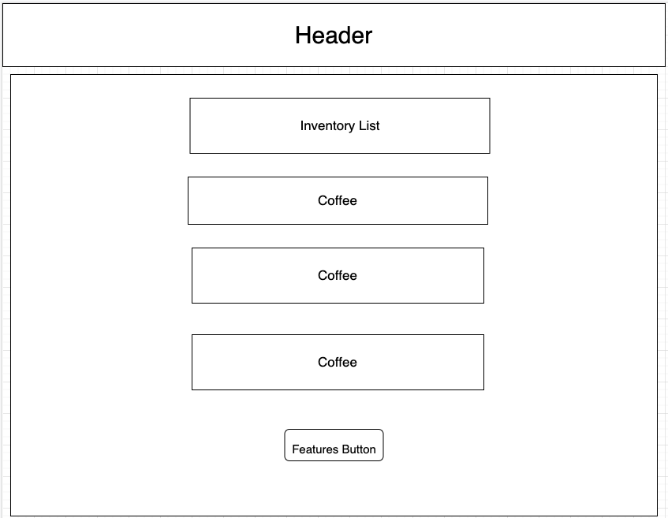

# Inventory Tracker

#### By Keisha Hepner

## Technologies Used

* React
* JavaScript
* HTML
* CSS
* Webpack

## Description

This application tracks inventory at a coffee distributer. Users are able to add sacks of coffee beans detailing their name, country of origin, roast and price. Users are able to Edit, Delete and Create new Sacks of coffee. This application also tracks quantity by decrementing stock each time coffee is purchased by a client and states when out of stock. 

## Setup/Installation Requirements

* Clone repository using url https://github.com/KeishaMarie/Inventory-Tracker.git
* Run npm install then run npm build
* Run npm run start to start application in local host

## Known Bugs
* Decrementation does not stay fixed when navigating from the page.

## MIT License
Copyright (c) <2022>

Permission is hereby granted, free of charge, to any person obtaining a copy of this software and associated documentation files (the "Software"), to deal in the Software without restriction, including without limitation the rights to use, copy, modify, merge, publish, distribute, sublicense, and/or sell copies of the Software, and to permit persons to whom the Software is furnished to do so, subject to the following conditions:

The above copyright notice and this permission notice shall be included in all copies or substantial portions of the Software.

THE SOFTWARE IS PROVIDED "AS IS", WITHOUT WARRANTY OF ANY KIND, EXPRESS OR IMPLIED, INCLUDING BUT NOT LIMITED TO THE WARRANTIES OF MERCHANTABILITY, FITNESS FOR A PARTICULAR PURPOSE AND NONINFRINGEMENT. IN NO EVENT SHALL THE AUTHORS OR COPYRIGHT HOLDERS BE LIABLE FOR ANY CLAIM, DAMAGES OR OTHER LIABILITY, WHETHER IN AN ACTION OF CONTRACT, TORT OR OTHERWISE, ARISING FROM, OUT OF OR IN CONNECTION WITH THE SOFTWARE OR THE USE OR OTHER DEALINGS IN THE SOFTWARE.